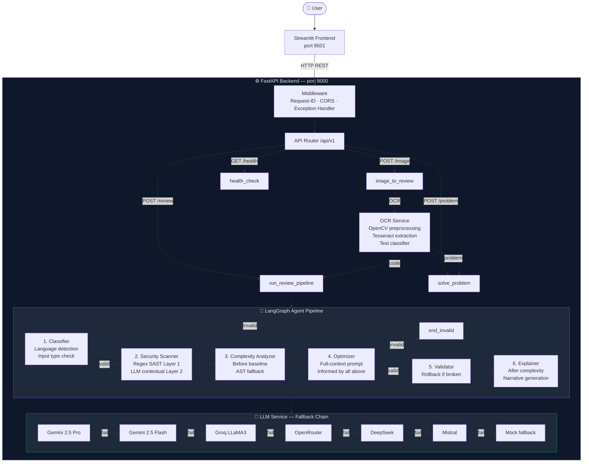
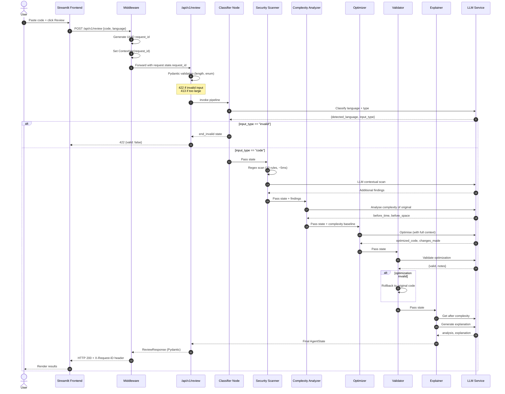
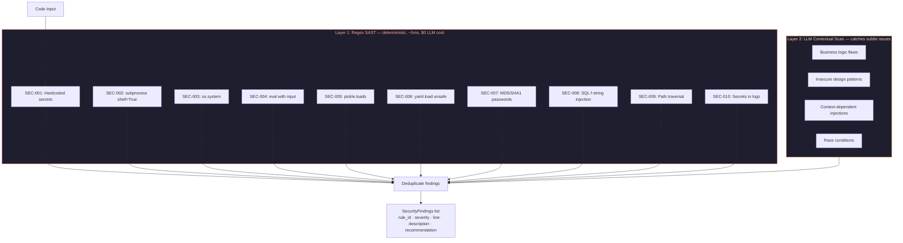

# Architecture Diagram

> Paste the block below into https://mermaid.live to render it, or view it directly on GitHub (renders automatically in `.md` files).

---

# Workflow Diagram — Request Lifecycle

---

# Security Scanner — Two-Layer Design

